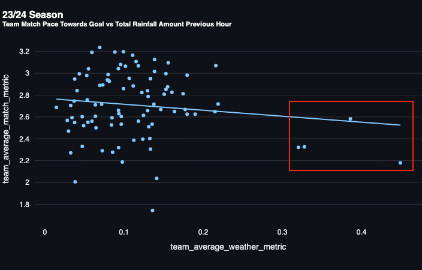
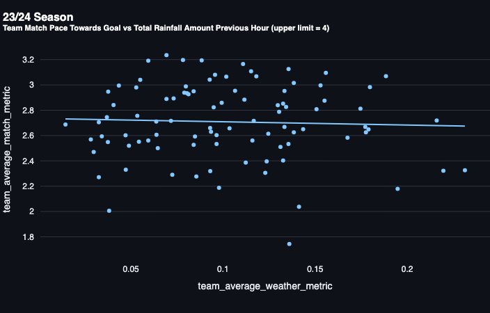
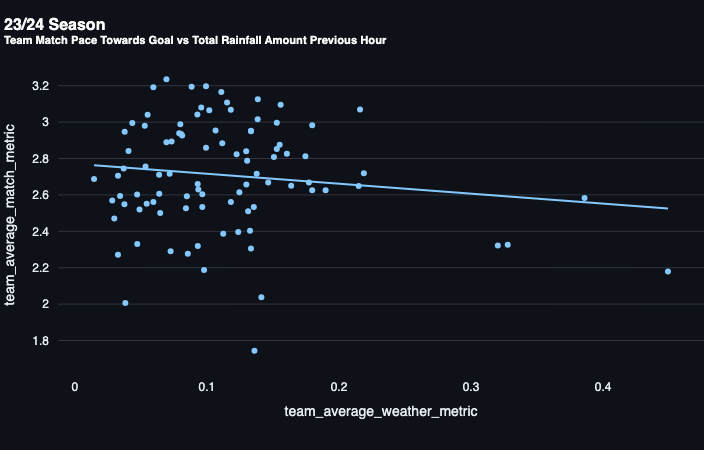

One of the most fascinating elements of data science is its potential to quantify often intangible real world phenomena. To use a popular example, football fans have always recognised that some chances are of a higher quality than others - an 6-yard tap-in is clearly more likely to result in a goal than a 30-yard volley. The advent of metrics like expected goals (xG) have changed the way we analyse and understand the game. 

But what about the influence of weather? While we might instinctively feel that a rain-slicked pitch and strong crosswinds can affect styles of play, these effects are rarely quantified. Can the elements actually influence styles of play or match outcomes? Using Met Office weather observation data in conjunction with StatsBomb football APIs, I set out to explore these questions and uncover how the weather affects the beautiful game. 

## Approach

Tools used:
- Snowflake
- Python
- Streamlit

This analysis is based on matches in the 23/24 season in the Premier League, Championship, League One and League Two. These leagues and this season were chosen due to data constraints - I only had access to UK weather observations and I wanted a full season of data (hence not choosing the current season). In hindsight, I could have also included the 22/23 season, but I was unsure how intensive the requests and queries would be. I might update this post in the future with past or current season data to increase the sample size. 

### 1.  Stadiums 

I gathered a list of Stadiums in the UK with the help of Google and a bit of ChatGPT, then tweaked the team names and stadium names to match those used by StatsBomb. I then ran a simple function to translate the postcode to the Met Office postcode sector format (e.g. ‘PL2 3DQ’  -> ‘PL2_3’). This would allow me to look up the weather observations for a particular stadium postcode sector. 

### 2. Met Office Weather Observations

Met Office “best estimate” observations via the Snowflake Marketplace. Sourced from Nowcast Analysis - a technique for very short-range forecasting.This combines their station, satellite and radar observations onto a 2km grid, with terrain adjustment to interpolate between station locations, giving a best estimate of actual weather conditions in population centres. A new observation is produced every hour for each postcode in the UK, and includes the parameters listed below as well as several others such as solar elevation angle and visibility screen level.

I selected the following columns as the most likely to have an impact on playing conditions:

Column
Definition
Total_rainfall_amount_previous_hour
Amount of rainfall in the previous hour measured in millimetres.
Wind_speed_10m
Average wind speed over the previous 15
minutes at 10m above the ground.
Wind_gust_10m
Extreme value of wind speed over the previous 15 minutes at 10m above the ground.
Feels_like_temperature
Approximate temperature in celsius over the previous hour.

See full datasheets here: 
Nowcast
https://www.metoffice.gov.uk/binaries/content/assets/metofficegovuk/pdf/data/nowcasting-datasheet_2019.pdf

Postcode Sector
https://www.metoffice.gov.uk/binaries/content/assets/metofficegovuk/pdf/data/postcode-sector-data-parameters-and-locations.pdf

### 3. StatsBomb Match Overview

A basic overview of each match in the four leagues for the 23/24 season, gathered using the `matches` method of the StatsBombPy library.

> I hadn’t realised that StatsBomb included the stadium name in their match metrics. I could have saved time by inserting the postcode/postcode sector reference into the match metrics instead of creating my separate stadium list.

Using stadium postcode sectors and match timestamps in a join, I created a new table containing the match overviews and observations within three hours of kick off timestamps. For example, a 3PM kick-off would return the 3PM, 4PM and 5PM observations to hopefully give a full picture of the weather conditions just before and during the match. 

I also had to do some minor datetime manipulation after discovering that StatsBomb kick off times are published in Eastern European Time (UTC+2), a fact that was pretty well hidden in the StatsBomb documentation.

#### 4. StatsBomb Team Match Metrics 

I selected the following columns that I felt were likely to be impacted by weather conditions. 
Column
Definition
Team_match_directness
A ratio of the distance towards goal from the start of a possession that ended in a shot, divided by the total distance travelled in buildup to the shot. 
Team_match_pace_towards_goal
The average speed of buildup for possessions that end in shots, from the start of possession to shot (m/s)
Team_match_gk_pass_distance
Average length of pass from a goalkeeper when playing out from the back.
Team_match_gk_long_pass_ratio
Percentage of goalkeeper long passes that are completed.
Team_match_ball_in_play_time
Actual clock time the ball spends in play
Team_match_dribble_ratio
Percentage of dribbles that were completed
Team_match_high_press_shots_conceded
Shots conceded from possessions that were lost within 5 seconds of a opposition defensive action in the team's half
Team_match_passing_ratio
Passing completion rate.

This Statsbomb dataset shares some columns with the Match Overview dataset, but focuses on a particular team’s performance in that given match. It includes over 150 different metrics, from “Goals scored from throw-ins” to “Shots generated from high press” to “Percentage of opponent dribbles completed”. 

The final dataset was created by joining the Weather Observation/Match Overview data with the StatsBomb Match Metrics on match ID, resulting in a table containing team metrics and weather conditions for every 23/34 match.

This is far from a complete list, but I selected these as metrics that I felt could possibly be impacted by weather conditions. For example, a wet surface might make ball control more difficult resulting in fewer dribbles completed, high wind speeds could result in fewer long range passes and so on. 

Finally, I created a small Streamlit web app to visualise the data and determine if there was any correlation between rainy/windy conditions and the match metrics. All the graphs seen from this point were generated in the Streamlit app.

> If you’d like access to the Streamlit app, give me a shout on Twitter[https://twitter.com/mattgirdler], LinkedIn [https://www.linkedin.com/in/matt-girdler-5740a3a7] or BlueSky [https://bsky.app/profile/matthewgirdler.com] and I’ll pass on the details. 

## Observations
One of the most fascinating elements of data science is its potential to
quantify often intangible real world phenomena. To use a popular
example, football fans have always recognised that some chances are of a
higher quality than others - an 6-yard tap-in is clearly more likely to
result in a goal than a 30-yard volley. The advent of metrics like
expected goals (xG) have changed the way we analyse and understand the
game.

But what about the influence of weather? While we might instinctively
feel that a rain-slicked pitch and strong crosswinds can affect styles
of play, these effects are rarely quantified. Can the elements actually
influence styles of play or match outcomes? Using Met Office weather
observation data in conjunction with StatsBomb football APIs, I set out
to explore these questions and uncover how the weather affects the
beautiful game.

\## Approach

Tools used:

-   Snowflake

-   Python

-   Streamlit

This analysis is based on matches in the 23/24 season in the Premier
League, Championship, League One and League Two. These leagues and this
season were chosen due to data constraints - I only had access to UK
weather observations and I wanted a full season of data (hence not
choosing the current season). In hindsight, I could have also included
the 22/23 season, but I was unsure how intensive the requests and
queries would be. I might update this post in the future with past or
current season data to increase the sample size.

**\### 1. Stadiums**

I gathered a list of Stadiums in the UK with the help of Google and a
bit of ChatGPT, then tweaked the team names and stadium names to match
those used by StatsBomb. I then ran a simple function to translate the
postcode to the Met Office postcode sector format (e.g. 'PL2 3DQ' -\>
'PL2_3'). This would allow me to look up the weather observations for a
particular stadium postcode sector.

{width="6.267716535433071in"
height="1.7083333333333333in"}

**\### 2. Met Office Weather Observations**

Met Office "best estimate" observations via the Snowflake Marketplace.
Sourced from Nowcast Analysis - a technique for very short-range
forecasting.This combines their station, satellite and radar
observations onto a 2km grid, with terrain adjustment to interpolate
between station locations, giving a best estimate of actual weather
conditions in population centres. A new observation is produced every
hour for each postcode in the UK, and includes the parameters listed
below as well as several others such as solar elevation angle and
visibility screen level.

{width="6.267716535433071in"
height="1.8055555555555556in"}

I selected the following columns as the most likely to have an impact on
playing conditions:

+-----------------------------------+-----------------------------------+
| **Column**                        | **Definition**                    |
+===================================+===================================+
| To                                | Amount of rainfall in the         |
| tal_rainfall_amount_previous_hour | previous hour measured in         |
|                                   | millimetres.                      |
+-----------------------------------+-----------------------------------+
| Wind_speed_10m                    | Average wind speed over the       |
|                                   | previous 15                       |
|                                   |                                   |
|                                   | minutes at 10m above the ground.  |
+-----------------------------------+-----------------------------------+
| Wind_gust_10m                     | Extreme value of wind speed over  |
|                                   | the previous 15 minutes at 10m    |
|                                   | above the ground.                 |
+-----------------------------------+-----------------------------------+
| Feels_like_temperature            | Approximate temperature in        |
|                                   | celsius over the previous hour.   |
+-----------------------------------+-----------------------------------+

See full datasheets here:

**Nowcast**

[[https://www.metoffice.gov.uk/binaries/content/assets/metofficegovuk/pdf/data/nowcasting-datasheet_2019.pdf]{.underline}](https://www.metoffice.gov.uk/binaries/content/assets/metofficegovuk/pdf/data/nowcasting-datasheet_2019.pdf)

**Postcode Sector**

[[https://www.metoffice.gov.uk/binaries/content/assets/metofficegovuk/pdf/data/postcode-sector-data-parameters-and-locations.pdf]{.underline}](https://www.metoffice.gov.uk/binaries/content/assets/metofficegovuk/pdf/data/postcode-sector-data-parameters-and-locations.pdf)

**\### 3. StatsBomb Match Overview**

A basic overview of each match in the four leagues for the 23/24 season,
gathered using the \`matches\` method of the StatsBombPy library.

{width="6.267716535433071in"
height="1.6944444444444444in"}

\> I hadn't realised that StatsBomb included the stadium name in their
match metrics. I could have saved time by inserting the
postcode/postcode sector reference into the match metrics instead of
creating my separate stadium list.

{width="6.267716535433071in"
height="2.388888888888889in"}

Using stadium postcode sectors and match timestamps in a join, I created
a new table containing the match overviews and observations within three
hours of kick off timestamps. For example, a 3PM kick-off would return
the 3PM, 4PM and 5PM observations to hopefully give a full picture of
the weather conditions just before and during the match.

I also had to do some minor datetime manipulation after discovering that
StatsBomb kick off times are published in Eastern European Time (UTC+2),
a fact that was pretty well hidden in the StatsBomb documentation.

**\#### 4. StatsBomb Team Match Metrics**

I selected the following columns that I felt were likely to be impacted
by weather conditions.

--------------------------------------------------------------------------

  **Column**                             **Definition**

-------------------------------------- -----------------------------------

  Team_match_directness                  A ratio of the distance towards
                                         goal from the start of a possession
                                         that ended in a shot, divided by
                                         the total distance travelled in
                                         buildup to the shot.

  Team_match_pace_towards_goal           The average speed of buildup for
                                         possessions that end in shots, from
                                         the start of possession to shot
                                         (m/s)

  Team_match_gk_pass_distance            Average length of pass from a
                                         goalkeeper when playing out from
                                         the back.

  Team_match_gk_long_pass_ratio          Percentage of goalkeeper long
                                         passes that are completed.

  Team_match_ball_in_play_time           Actual clock time the ball spends
                                         in play

  Team_match_dribble_ratio               Percentage of dribbles that were
                                         completed

  Team_match_high_press_shots_conceded   Shots conceded from possessions
                                         that were lost within 5 seconds of
                                         a opposition defensive action in
                                         the team\'s half

  Team_match_passing_ratio               Passing completion rate.
  --------------------------------------------------------------------------

This Statsbomb dataset shares some columns with the Match Overview
dataset, but focuses on a particular team's performance in that given
match. It includes over 150 different metrics, from "Goals scored from
throw-ins" to "Shots generated from high press" to "Percentage of
opponent dribbles completed".

The final dataset was created by joining the Weather Observation/Match
Overview data with the StatsBomb Match Metrics on match ID, resulting in
a table containing team metrics and weather conditions for every 23/34
match.

This is far from a complete list, but I selected these as metrics that I
felt could possibly be impacted by weather conditions. For example, a
wet surface might make ball control more difficult resulting in fewer
dribbles completed, high wind speeds could result in fewer long range
passes and so on.

Finally, I created a small Streamlit web app to visualise the data and
determine if there was any correlation between rainy/windy conditions
and the match metrics. All the graphs seen from this point were
generated in the Streamlit app.

\> If you'd like access to the Streamlit app, give me a shout on
Twitter\[[[https://twitter.com/mattgirdler]{.underline}](https://twitter.com/mattgirdler)\],
LinkedIn
\[[[https://www.linkedin.com/in/matt-girdler-5740a3a7]{.underline}](https://www.linkedin.com/in/matt-girdler-5740a3a7)\]
or BlueSky
\[[[https://bsky.app/profile/matthewgirdler.com]{.underline}](https://bsky.app/profile/matthewgirdler.com)\]
and I'll pass on the details.

**\## Observations**

My approach was to determine if there was a correlation between any of
the match metrics and the weather metrics. I used a simple Pearson
correlation coefficient, which measures the ratio of covariance between
two variables. It ranges from -1 to 1, with +1 implying that X increases
exactly as Y increases, -1 implying that Y increases while X decreases,
and 0 implying that there is no dependency between the variables.

As such, I was looking to see if there was a linear correlation,
positive or negative, between any of the metrics when facing adverse
weather conditions.

\### Rain

The values for \`total_rainfall_previous_hour\` ranged between 0 (for
the absence of any rain) and a maximum value of 28.9 which was linked to
a match between Arsenal and Manchester United on 12th May 2024. I
initially thought this was a bug in the data - the next highest values
in the dataset are 17.9 and 10.8 before dropping into single digits.
However, this match famously saw the roof of Old Trafford leaking huge
amounts of water, so it proved to be a nice test case for the data
collection.

{width="4.411458880139983in"
height="4.411458880139983in"}

Rainfall vs Directness

{width="6.267716535433071in" height="4.0in"}

Rainfall vs Pace Towards Goal

{width="6.267716535433071in" height="4.0in"}

Rainfall vs Goalkeeper Passing Distance

{width="6.267716535433071in" height="4.0in"}

\## Wind

The secondary weather condition that can potentially have a significant
impact on playing conditions is wind. Strong gusts can cause the ball to
move unpredictably, which can be more noticeable for long range passes
and shots.

"Because wind is an element that varies rapidly over very short periods
of time it is sampled at high frequency (every 0.25 sec) to capture the
intensity of gusts, or short-lived peaks in speed, which inflict
greatest damage in storms. The gust speed and direction are defined by
the maximum three second average wind speed occurring in any period.

A better measure of the overall wind intensity is defined by the average
speed and direction over the ten minute period leading up to the
reporting time."

Assuming knots as the measurement, I used the Beaufort scale to
determine the minimum value that could impact playing conditions. 5 on
the Beaufort scale is described as "Small trees and leaves begin to
sway" which I would consider enough to impact things like the flight of
the ball. {width="6.267716535433071in"
height="6.763888888888889in"}

Using a bar chart, we can see that the variance between team match
directness and total rainfall previous hour looks to be all over the
place.

If we switch to a scatter graph we can see a small trend between
rainfall and pace towards goal.

As a Plymouth Argyle fan, I was curious to note that they had a higher
than average correlation between rainfall and various match metrics. For
example, goalkeeper passing distance, directness and pace towards goal
all increased with the levels of rainfall. The effect was slightly more
pronounced for away games, reflecting an increased tendency to "go long"
in away games and particularly in wet conditions.

{width="5.956188757655293in"
height="3.8080555555555557in"}

{width="6.267716535433071in"
height="4.0in"}{width="6.267716535433071in"
height="4.0in"}

\## Final Thoughts

A single season of data isn\'t quite enough to gain many meaningful
insights.

It may be useful to apply a clamp to some of the weather metrics. I
suspect there\'s a threshold at which rainfall begins to impact playing
conditions, and any increased rain beyond that is almost incidental. As
it stands, the outliers such as Man United vs Arsenal appear to be
skewing the data towards one or two matches instead of tracking overall
trends.

